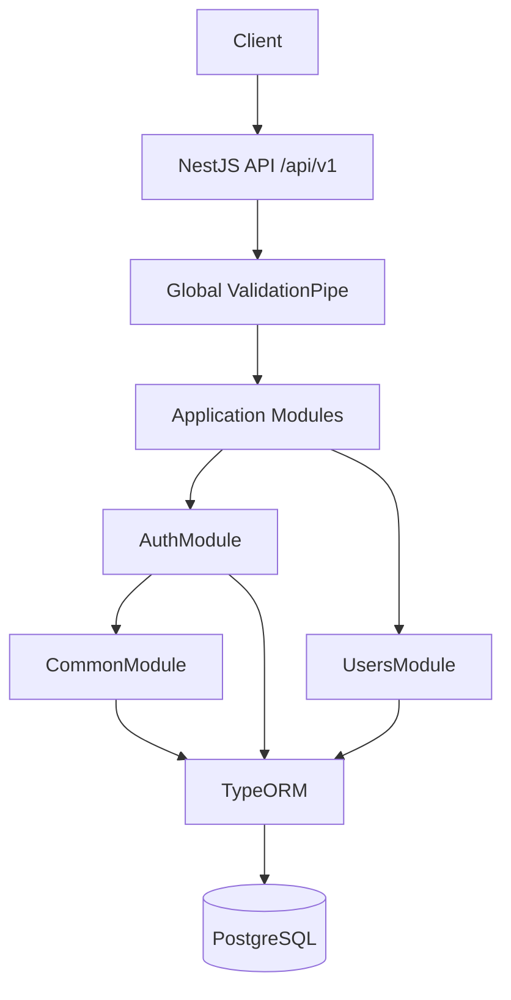
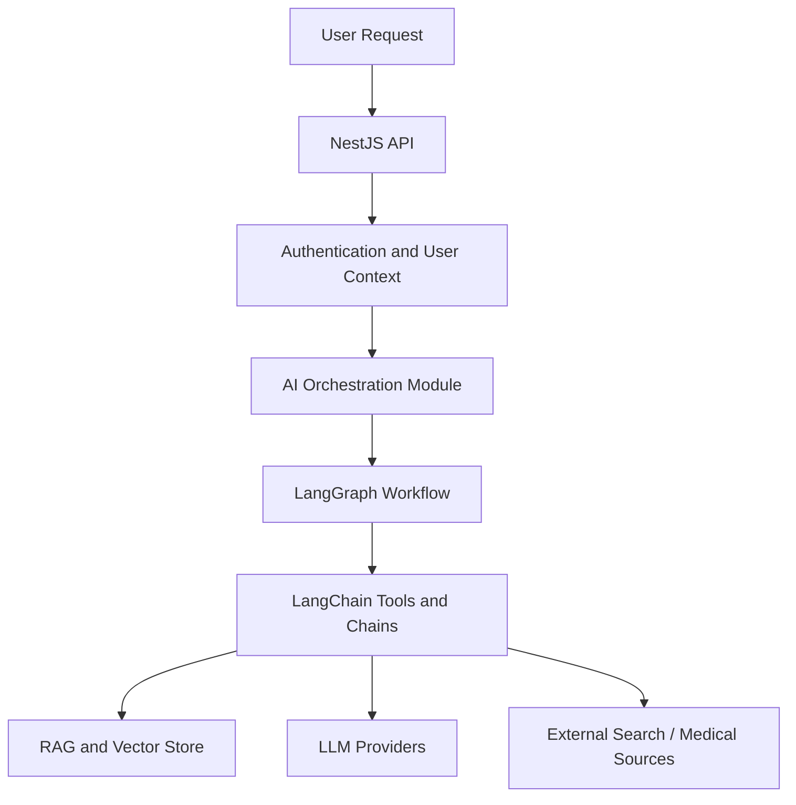

# Mediflow AI Backend

Mediflow AI Backend is a NestJS and TypeScript API intended to become an AI-powered health assistant for medical conversations, document analysis, RAG, multi-LLM workflows, specialist discovery, and voice interaction.

The current repository is an early backend foundation. It implements the core NestJS application structure, PostgreSQL persistence with TypeORM, user registration, login, refresh-token rotation, logout, password reset/change flows, authenticated account/profile endpoints, standardized success/error response envelopes, Swagger/OpenAPI documentation, paginated listings, validation, linting, formatting, and tests. The AI, RAG, LangChain, and LangGraph capabilities are planned but are not implemented in the current codebase.

## Overview

The project is being built as a modular backend for a healthcare-oriented assistant. The present implementation focuses on the API, database, authentication, and user-account groundwork that future AI modules can build on.

Current maturity:

- API foundation is in place.
- User persistence and account lifecycle logic are in place.
- Access/refresh token generation and rotation are in place.
- Password reset and password change flows are in place.
- AI orchestration, medical document analysis, vector storage, and provider integrations are planned future work.

Health information generated by future AI features should be treated as informational only. It must not be used as a substitute for professional medical diagnosis, treatment, or emergency care.

## Key Features

### Currently Implemented

- NestJS 12 application using TypeScript and native ESM.
- Global API prefix: `/api/v1`.
- Global validation pipe with DTO transformation, whitelisting, and non-whitelisted property rejection.
- PostgreSQL connection through TypeORM.
- Environment validation for core database settings.
- User registration with email uniqueness checks.
- Password hashing with `bcrypt`.
- Paginated user listing (`page`/`limit` query, `{ items, meta }` payload).
- Standardized success envelope (`success`, `statusCode`, `message`, `data`, `timestamp`) via a global interceptor.
- Standardized error envelope (`success: false`, `statusCode`, `message`, `errors?`, `timestamp`) via a global exception filter.
- Swagger UI at `/api/docs` with Bearer auth, per-endpoint summaries, realistic DTO examples, and envelope-accurate response schemas.
- Login with email/password validation.
- Access-token and refresh-token generation using `@nestjs/jwt`.
- Refresh-token and reset-password token hash storage on `users`.
- JWT access and refresh guards with Passport strategies.
- Authenticated account profile, settings, change-password, and logout endpoints.
- User and session entities with UUID primary keys and timestamp columns.
- Basic shared `CommonModule` and `CommonService`.
- Vitest unit and e2e test setup.
- ESLint flat config and Prettier formatting workflow.

### Partially Implemented / Not Yet Wired

- Role field exists on the `User` entity, but role-based authorization policies are not implemented yet.

### Planned / Future Scope

- AI-powered health conversations.
- Medical document and prescription analysis.
- LangChain integration.
- LangGraph-based workflow orchestration.
- RAG pipeline with embeddings and vector database storage.
- Multi-LLM provider abstraction and routing.
- OpenAI, Gemini, Groq, or other provider support.
- Tavily-powered web search.
- Source-backed medical information responses.
- Specialist or doctor discovery based on health discussions.
- Conversation history and memory.
- Secure medical document handling.
- Voice interaction.
- Role-based access control.
- Migrations and production database lifecycle management.
- Observability, deployment, and operational hardening.

## Tech Stack

### Current

- Node.js
- NestJS 12
- TypeScript 6
- PostgreSQL
- TypeORM
- `@nestjs/config`
- `@nestjs/jwt`
- `bcrypt`
- `class-validator` and `class-transformer`
- Vitest and Supertest
- ESLint flat config
- Prettier

### Installed But Not Fully Wired

- `passport-local`

### Planned

- LangChain
- LangGraph
- LLM providers such as OpenAI, Gemini, and Groq
- Tavily web search
- Vector database or vector store
- Medical document processing
- Voice processing

## Architecture

The current architecture is a modular NestJS API with application modules for authentication and users, a shared common module, and a database module that configures TypeORM.



Planned AI architecture:



The second diagram represents the intended direction only. These AI modules are not present in the current `src/` tree.

## Project Structure

```text
src/
  app.controller.ts          Root health/starter endpoint
  app.module.ts              Root module composition
  app.service.ts             Root starter service
  main.ts                    Nest bootstrap, validation pipe, API prefix, Swagger setup
  config/
    env.validation.ts        Environment validation
  database/
    database.module.ts       TypeORM PostgreSQL configuration
  common/
    constants/               Shared message constants
    decorators/swagger/      Reusable API docs decorators
    dto/                     Success/error envelopes and pagination contract
    entities/                Shared base entity
    enums/                   Environment and role enums
    filters/                 Global error-envelope filter
    guards/                  JWT access and refresh guards
    interceptors/            Global success-envelope interceptor
    interfaces/              Shared TypeScript interfaces
    services/                Shared CommonService
    utils/                   Shared utility functions
  modules/
    auth/                    Signup/login/refresh/logout/password flows, DTOs, docs
    users/                   User listing, account endpoints, DTOs, docs
test/
  app.e2e-spec.ts            Health e2e test
  auth.e2e-spec.ts           Auth lifecycle e2e test
  users.e2e-spec.ts          Users pagination e2e test
```

Some directories such as `common/middlewares` and `auth/entities` exist as placeholders but do not currently contain implementation files.

## API and Modules

All routes are served under the global `/api/v1` prefix. All success responses use the standard envelope (`success`, `statusCode`, `message`, `data`, `timestamp`); all errors use the matching error envelope with an optional `errors` array. `204 No Content` responses carry no body.

| Module  | Route                                  | Current behavior                                                                           |
| ------- | -------------------------------------- | ------------------------------------------------------------------------------------------ |
| App     | `GET /api/v1`                          | Health check wrapped in the success envelope                                               |
| Auth    | `POST /api/v1/auth/signup`             | Registers a user and returns the user plus an access/refresh token pair                    |
| Auth    | `POST /api/v1/auth/login`              | Validates credentials and returns the user plus an access/refresh token pair               |
| Auth    | `POST /api/v1/auth/refresh_token`      | Rotates the refresh token using the `refreshToken` body field                              |
| Auth    | `POST /api/v1/auth/logout`             | Clears the current user's stored refresh-token hash (`204`)                                |
| Auth    | `POST /api/v1/auth/forgot-password`    | Generates and stores a hashed reset token; mock email hook is invoked (`204`)              |
| Auth    | `POST /api/v1/auth/reset-password`     | Validates reset token and sets a new password (`204`)                                      |
| Account | `GET /api/v1/account/profile`          | Returns the sanitized authenticated user profile                                           |
| Account | `POST /api/v1/account/change-password` | Changes password after current-password verification and invalidates refresh state (`204`) |
| Account | `PATCH /api/v1/account/settings`       | Updates validated profile/settings fields                                                  |
| Users   | `GET /api/v1/users?page=1&limit=20`    | Returns paginated users (`data.items` plus `data.meta`) ordered by creation date           |

### Response envelopes

```json
{
  "success": true,
  "statusCode": 200,
  "message": "Users retrieved successfully",
  "data": {},
  "timestamp": "2026-10-02T16:10:00.000Z"
}
```

```json
{
  "success": false,
  "statusCode": 400,
  "message": "Validation failed",
  "errors": ["email must be a valid email address"],
  "timestamp": "2026-10-02T16:10:00.000Z"
}
```

### Pagination

Every array endpoint accepts `page` (default `1`) and `limit` (default `20`, max `100`) and returns:

```json
{
  "items": [],
  "meta": {
    "page": 1,
    "limit": 20,
    "totalItems": 42,
    "totalPages": 3,
    "hasNextPage": true,
    "hasPreviousPage": false
  }
}
```

### Swagger

Interactive API documentation is served at `/api/docs` (OpenAPI JSON at `/api/docs-json`). Use the **Authorize** button with an access JWT from signup/login for protected routes.

## Authentication

Current login flow:

1. Client posts email and password to `POST /api/v1/auth/login`.
2. `AuthService` looks up the user by email through `CommonService`.
3. The service checks whether the user is active.
4. Password is compared using `bcrypt`.
5. Access and refresh JWTs are generated.
6. The refresh token is hashed with bcrypt and stored on the user.
7. Previous refresh state is replaced during refresh-token rotation.
8. The user and token pair are returned inside the standard success envelope.

JWT guards protect account routes and the user listing route. Refresh-token rotation stores only bcrypt hashes and clears refresh state on logout, password reset, and password change.

## Database

The project uses PostgreSQL with TypeORM.

Configured behavior:

- `autoLoadEntities: true`
- `synchronize: true` only when `NODE_ENV === 'development'`
- SQL logging only when `NODE_ENV === 'development'`
- TypeORM cache enabled

Current entities:

| Entity       | Table     | Purpose                                                                                                    |
| ------------ | --------- | ---------------------------------------------------------------------------------------------------------- |
| `User`       | `users`   | Stores email, password hash, refresh-token hash, reset-token hash/expiry, settings, role, and active state |
| `BaseEntity` | inherited | Provides UUID `id`, `created_at`, and `updated_at` columns                                                 |

No migrations are present in the repository at this stage.

## Environment Variables

The following variables are referenced by the current application or shown in `.env.example`:

```env
NODE_ENV=development
PORT=3000

DATABASE_HOST=localhost
DATABASE_PORT=5432
DATABASE_USER=postgres
DATABASE_PASSWORD=
DATABASE_NAME=mediflow_ai_db

JWT_ACCESS_SECRET=
JWT_REFRESH_SECRET=
JWT_ACCESS_EXPIRES_IN=15m
JWT_REFRESH_EXPIRES_IN=7d
```

`NODE_ENV`, `DATABASE_HOST`, `DATABASE_PORT`, `DATABASE_USER`, `DATABASE_PASSWORD`, and `DATABASE_NAME` are validated at startup. JWT variables are used by the auth service and should be set before using login or refresh-token endpoints.

Do not commit real secrets or production credentials.

## Getting Started

1. Install dependencies:

   ```bash
   npm install
   ```

2. Create a local `.env` file using `.env.example` as a reference.

3. Start PostgreSQL and create the configured database.

4. Start the development server:

   ```bash
   npm run start:dev
   ```

5. Open the API at:

   ```text
   http://localhost:3000/api/v1
   ```

There is no migration command yet. In development, TypeORM synchronization is enabled when `NODE_ENV=development`.

## Available Scripts

| Script                 | Description                                              |
| ---------------------- | -------------------------------------------------------- |
| `npm run build`        | Build the NestJS application                             |
| `npm run deploy`       | Run Nest CLI deploy command                              |
| `npm run start`        | Start the application                                    |
| `npm run start:dev`    | Start in watch mode                                      |
| `npm run start:debug`  | Start in debug watch mode                                |
| `npm run start:prod`   | Run the built app from `dist/main`                       |
| `npm run lint`         | Run ESLint                                               |
| `npm run lint:fix`     | Run ESLint with automatic fixes                          |
| `npm run format`       | Format source, tests, and root config/docs with Prettier |
| `npm run format:check` | Check Prettier formatting                                |
| `npm run test`         | Run unit tests with Vitest                               |
| `npm run test:watch`   | Run Vitest in watch mode                                 |
| `npm run test:cov`     | Run tests with coverage                                  |
| `npm run test:debug`   | Run Vitest in debug mode                                 |
| `npm run test:e2e`     | Run e2e tests                                            |

## Testing

The repository uses Vitest:

- Unit specs are matched with `**/*.spec.ts`.
- E2E specs are matched with `**/*.e2e-spec.ts`.
- `vite-tsconfig-paths` resolves the TypeScript path aliases during tests.

Current tests cover the root controller, the full auth lifecycle (signup, login, refresh, password change, profile access, validation errors), the users pagination contract, and pagination metadata math.

## Security Notes

Currently implemented security-related pieces:

- DTO validation using `class-validator`.
- Global request validation with whitelisting and unknown property rejection.
- Password hashing with `bcrypt`.
- Access and refresh JWT generation.
- Refresh-token rotation with bcrypt-hashed refresh tokens.
- Reset-password tokens stored as hashes with expiration.
- Global `ClassSerializerInterceptor` strips password/token hash fields from responses.
- Environment-based secrets for JWT signing.

Not yet implemented:

- Role-based access control.
- Rate limiting.
- Secure document upload/storage.
- Audit logging.

Because this project targets healthcare use cases, future AI features should include strong privacy controls, source transparency, clear disclaimers, and safe escalation guidance.

## Roadmap

Near-term:

- Add role-based authorization.
- Add database migrations.
- Expand unit and e2e coverage beyond starter tests.

AI foundation:

- Add AI module boundaries and provider abstraction.
- Integrate LangChain for model calls and tool orchestration.
- Add LangGraph workflows for health-assistant flows.
- Add conversation persistence and context management.
- Add OpenAI, Gemini, Groq, or other provider adapters.

Health assistant capabilities:

- Add RAG ingestion and retrieval.
- Add vector database integration.
- Add medical document and prescription analysis.
- Add Tavily-backed web search with source-backed responses.
- Add specialist discovery workflows.
- Add voice interaction.
- Improve privacy, observability, and deployment readiness.

## Development Guidelines

- Keep modules small and focused.
- Document only implemented behavior as current behavior.
- Use DTOs and validation for request payloads.
- Prefer typed services and provider abstractions as AI capabilities are added.
- Run lint, format checks, build, and relevant tests before opening a pull request.

```bash
npm run lint
npm run format:check
npm run build
npm run test
```

## License

This project is `UNLICENSED` as declared in `package.json`.
